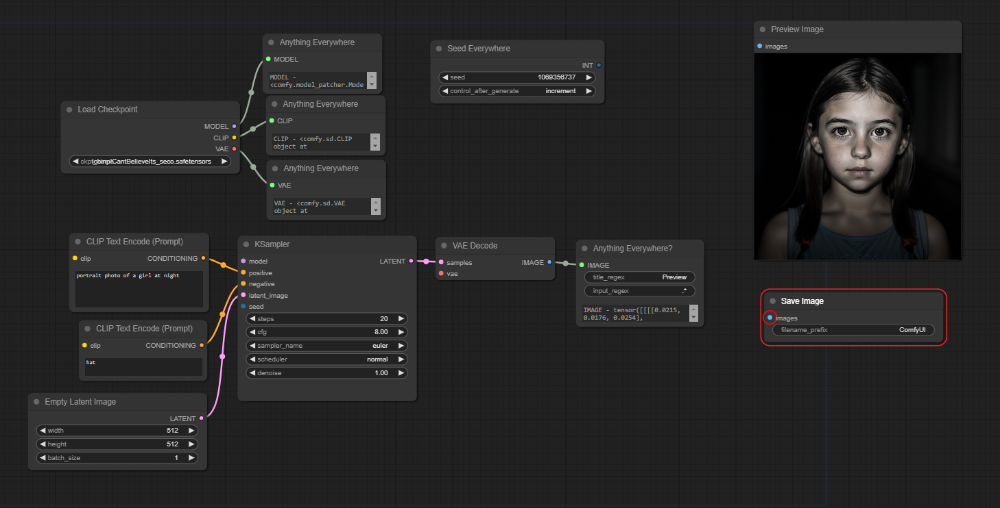
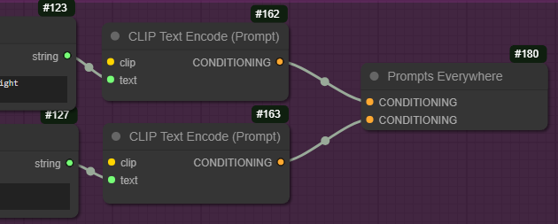

# UE Nodes

Shameless plug for my other nodes -> Check out [Image Picker](https://github.com/chrisgoringe/cg-image-picker) for another way to make some workflows smoother. And leave a star if you like something!

---

|Separate your workflow logically without spaghetti|This image has a simple example workflow you can drop onto Comfy|
|-|-|
|||

# v3 - 10th October 2023

## Installing

Use Comfy Manager. If you really want to do it manually, just clone this repository in your custom_nodes directory.

## Anything Everywhere (start here!)

The `Anything Everywhere` node has a single input, initially labelled 'anything'. Connect anything to it (directly - not via a reroute), and the input name changes to match the input type. Disconnect and it goes back to 'anything'.

When you run the prompt, any unconnected input, anywhere in the workflow, which matches that type, will act as if it were connected to the same input. 

To visualise what it's being connected to, right-click on the background canvas and select `Toggle UE Link Visibility`.

## Anything Everywhere? - control matching with regex rules

This node adds two widgets - title_regex and input_regex. It will only send to input which match. So in the example, title_regex is 'Preview' so the image is sent to the Preview Image node but not the Save Image node.



*The matches are regular expressions, not string matches.* Most simple strings will work (matching any part of the title or input name), but some characters have special meanings (including various sorts of brackets, ^, $, /, and . in particular) so just avoid them if you aren't regex-inclined.

Using regex means you can use `^prompt` to match `prompt` at the beginning of the title only, to avoid matching `negative_prompt`.

Regex 101 - `^` means 'the start', `$` means 'the end', `.` matches any single character, `.*` matches anything of any length (including zero). For more than that, visit [regex101](https://regex101.com/) (the flavour you want is ECMAScript, though that probably won't matter).

## Seed Everywhere

Seed Everywhere connects to any unconnected INT input with `seed` in the input name (seed, noise_seed, etc), and it has the control_after_generate feature. So if you convert the seed widgets to inputs you can use the same seed everywhere.

## Anything Everywhere3 - One node, three inputs.

Really just three `Anything Everywhere` nodes packaged together.  Designed for the outputs of Checkpoint Loader. 


## Prompts Everywhere - two strings or conditionings

Prompt Everywhere has two inputs. They will be sent with regex matching rules of `(^prompt|^positive)` and `neg` respectively. These should match the various versions of names that get used for prompts and negative prompts or conditionings.

|strings|conditionings|
|-|-|
||

# Other features

## Priorities

If there is more than one sending node that matches an input, the basic rules is that the more specific node wins. The order of priorities is:

- `Anything Everywhere?` 
- `Seed Everywhere` and `Prompts Everywhere`
- `Anything Everywhere`
- `Anything Everywhere3`

If two nodes with the same priority both match *neither will connect* 

## Visualise

If something isn't working right, right click on the background canvas and `Toggle UE Link Visibility` to see all the links being made by the UE nodes.
|Visualise off|Visualise on|
|-|-|
|||

## See what is sent

The nodes which only have one output can also gain a text box showing exactly what passed through the node. You need to turn this on if you want it - it's in the main settings, 'Anything Everywhere node details'.

## Logging/Debugging

The JavaScript console (press f12 in some browsers) has logging information about what is being connected. You can change the level of detail by finding the file `[comfy_install]/custom_nodes/cg-use-everywhere/js/use_everywhre_utilities.js` and near the top finding this bit:
```javascript
    static ERROR       = 0; // actual errors
    static PROBLEM     = 1; // things that stop the workflow working
    static INFORMATION = 2; // record of good things
    static DETAIL      = 3; // details

    static LEVEL = Logger.PROBLEM;
    static TRACE = false;   // most of the method calls
```
Change the `LEVEL` to `Logger.INFORMATION` for more, or `Logger.DETAIL` for even more; set `TRACE` to `true` for some other debugging information.

## Caution

It's possible to create a loop with UE, and that currently isn't detected ([issue](https://github.com/chrisgoringe/cg-use-everywhere/issues/6), [PR for ComfyUI](https://github.com/comfyanonymous/ComfyUI/pull/1652)). If you get a RecursionError that's probably what you've done. Remember, *every* unconnected input gets connected to the UE output, even optional ones... you might want to use `Anything Everywhere?` nodes if this is a problem.


# Deprecated nodes

For backward compatibility, all the old nodes are still supported for the time being - you can find them in everywhere/deprecated. [Old documentation](docs/deprecated.md)