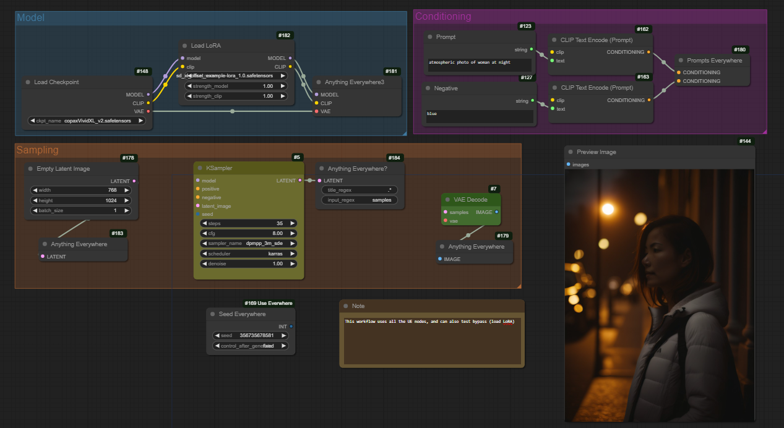
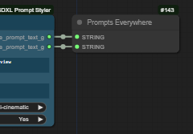
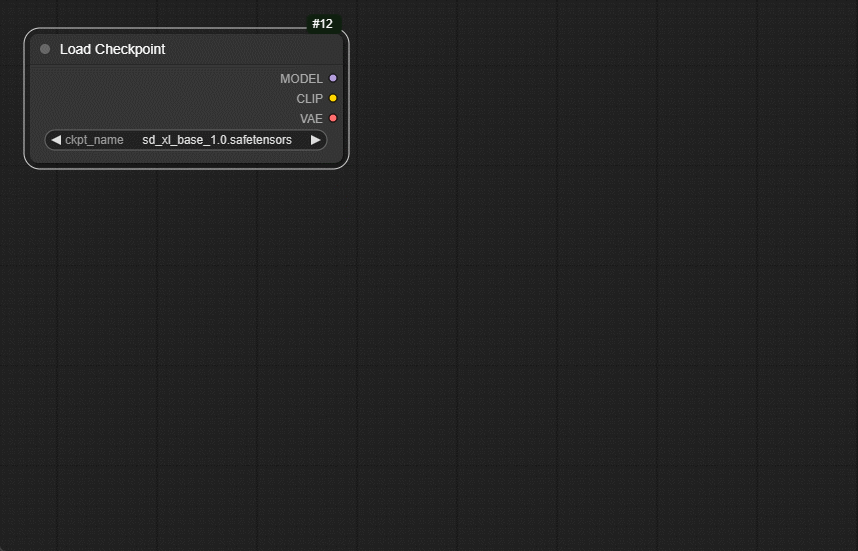
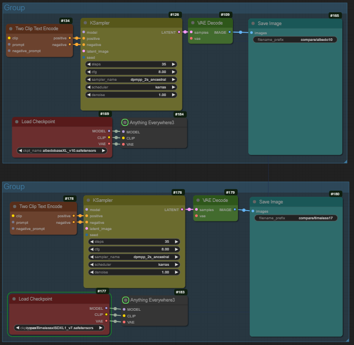
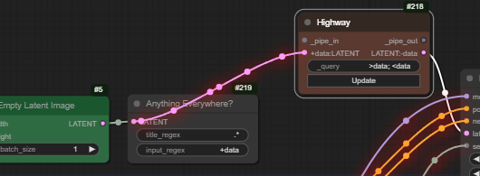
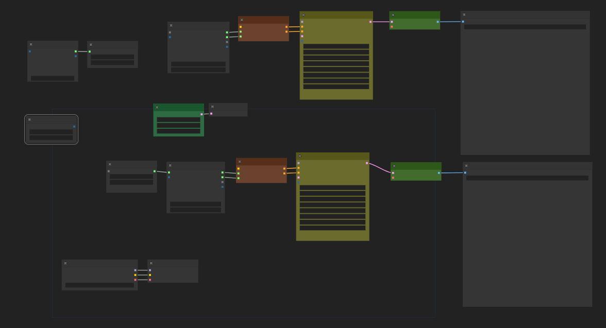
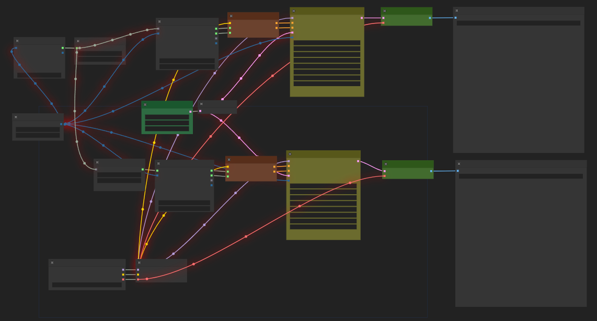
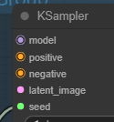

# UE Nodes

Getting started? Download the test workflow below and see how it works.

Problems? Jump down to [logging and debugging](https://github.com/chrisgoringe/cg-use-everywhere/blob/main/README.md#loggingdebugging)

Ideas for how to improve the nodes (or bug reports) - [raise an issue](https://github.com/chrisgoringe/cg-use-everywhere/issues)

Shameless plug for my other nodes -> Check out [Image Picker](https://github.com/chrisgoringe/cg-image-picker) for another way to make some workflows smoother. And leave a star if you like something!

---

## Test workflow

|This workflow uses all five nodes, and can be used to test (and understand!) the nodes. You wouldn't build it like this, it's just an example...|Here's an image with the workflow in|
|-|-|
|||

Or [the workflow as json](docs/test-workflow.json)

## Latest updates

4.3
- added support for targetting [Highway nodes](https://github.com/chrisgoringe/cg-use-everywhere#highway-nodes) 

4.2
- improved performance of loop detection, especially with [highway nodes](https://github.com/Trung0246/ComfyUI-0246)
- updated docs to not use other custom nodes in examples

4.1.2
- tweaks to improve handling of bypass 
- fixed connecting to Seed Everywhere 

4.1.1
- added option to turn animation off

4.1 

- added [loop detection](https://github.com/chrisgoringe/cg-use-everywhere#loop-checking) 
- added [group restriction](https://github.com/chrisgoringe/cg-use-everywhere#group-restriction).

The v1 nodes have been fully removed. If you were using one, you can just replace it with an `Anything Everywhere` node.

## Installing

Use Comfy Manager. If you really want to do it manually, just clone this repository in your custom_nodes directory.

## Anything Everywhere (start here!)

The `Anything Everywhere` node has a single input, initially labelled 'anything'. Connect anything to it (directly - not via a reroute), and the input name changes to match the input type. Disconnect and it goes back to 'anything'.

When you run the prompt, any unconnected input, anywhere in the workflow, which matches that type, will act as if it were connected to the same input. 

To visualise what it's being connected to, right-click on the background canvas and select `Toggle UE Link Visibility`.

## Anything Everywhere? - control matching with regex rules

This node adds two widgets - title_regex and input_regex. It will only send to inputs which match. So in the example, title_regex is 'Preview' so the image is sent to the Preview Image node but not the Save Image node. Note that you can rename node and input titles, which can help! 


*The matches are regular expressions, not string matches.* Most simple strings will work (matching any part of the title or input name), but some characters have special meanings (including various sorts of brackets, ^, $, /, and . in particular) so just avoid them if you aren't regex-inclined.

Using regex means you can use `^prompt` to match `prompt` at the beginning of the title only, to avoid matching `negative_prompt`.

Regex 101 - `^` means 'the start', `$` means 'the end', `.` matches any single character, `.*` matches anything of any length (including zero). For more than that, visit [regex101](https://regex101.com/) (the flavour you want is ECMAScript, though that probably won't matter).

## Seed Everywhere

Seed Everywhere connects to any unconnected INT input with `seed` in the input name (seed, noise_seed, etc), and it has the control_after_generate feature. So if you convert the seed widgets to inputs you can use the same seed everywhere.

## Anything Everywhere3 - One node, three inputs.

Really just three `Anything Everywhere` nodes packaged together.  Designed for the outputs of Checkpoint Loader. 


## Prompts Everywhere - two strings or conditionings

Prompt Everywhere has two inputs. They will be sent with regex matching rules of `(^prompt|^positive)` and `neg` respectively. These should match the various versions of names that get used for prompts and negative prompts or conditionings.

|strings|conditionings|
|-|-|
||

# Other features

## Shift drag

Shift click on an output node and drag then release to get an autocreate menu. This replaces the default behaviour (which gives you a search box), so you can disable it with the `Anything Everywhere replace search` setting.



## Group and color restriction

Any UE node can be restricted to only send within the group(s) it is part of, or only to nodes of the same color (or both). Right-click on the node and select `Send only within my group(s)`/`Remove group restriction` or `Send only to matching color`/`Remove color restriction`. UE nodes which are restricted (in either or both ways) have a green circle in the top-left corner. Here's part of a workflow that compares two models using this feature:



## Highway nodes

Trung 0246's [Highway nodes](https://github.com/Trung0246/ComfyUI-0246) are a pretty cool way of piping data around. You can target them with an `Anything Everywhere?` node by using an `input_regex` which matches the unconnected input name with the '+', like this:


This is new, so please report any issues!

## Loop checking

By default workflows are checked for loops before they are submitted (because UE can introduce them, and a loop results in a bad python outcome). If a loop is detected you'll get a JavaScript warning showing you the node ids involved. However, especially if there are other custom nodes involved, it's possible that the check will miss a loop, or flag one that isn't real.

If you get a warning and don't believe there is a loop (having checked the node ids listed!) you can turn loop checking off in the main settings menu. If something flagged as a loop runs fine, please [raise an issue](https://github.com/chrisgoringe/cg-use-everywhere/issues) and include the workflow in the report (save the json and zip it, because GitHub doesn't accept .json files). Likewise if a loop doesn't get caught.

I've written code for the core Comfy backend to catch loops, maybe it'll be included - [PR for ComfyUI](https://github.com/comfyanonymous/ComfyUI/pull/1652) - or maybe they have another plan.

## Priorities

If there is more than one sending node that matches an input, the basic rules is that the more specific node wins. The order of priorities is:

- `Anything Everywhere?` 
- `Seed Everywhere` and `Prompts Everywhere`
- `Anything Everywhere`
- `Anything Everywhere3`

Within each group, UE nodes with group restriction are prioritised over those without.

If two nodes with the same priority both match *neither will connect* - better to fail fast than have an ambiguous outcome.

## Visualise

If something isn't working right, right click on the background canvas and `Toggle UE Link Visibility` to see all the links being made by the UE nodes.
|Visualise off|Visualise on|
|-|-|
|||
If the animation effects are too much for your graphics (esp. when the workflow is running) you can turn them off in the main settings menu.

Connected inputs are also subtly marked as such - here the model, positive, and negative inputs are connected by UI, there is no connection to the latent, and the seed has a traditional connection. You can turn this effect off in the main preferences.

 

## See what is sent

The nodes which only have one output can also gain a text box showing exactly what passed through the node. You need to turn this on if you want it - it's in the main settings, 'Anything Everywhere node details'.

## Logging/Debugging

The JavaScript console (press f12 in some browsers) has logging information about what is being connected. You can change the level of detail by finding the file `[comfy_install]/custom_nodes/cg-use-everywhere/js/use_everywhre_utilities.js` and near the top finding this bit:
```javascript
    static ERROR       = 0; // actual errors
    static PROBLEM     = 1; // things that stop the workflow working
    static INFORMATION = 2; // record of good things
    static DETAIL      = 3; // details

    static LEVEL = Logger.PROBLEM;
    static TRACE = false;   // most of the method calls
```
Change the `LEVEL` to `Logger.INFORMATION` for more, or `Logger.DETAIL` for even more; set `TRACE` to `true` for some other debugging information.

If you have a problem, pressing f12 to see the JavaScript console can often help. The following steps are really helpful in making a good bug report:

- update to the latest version
- restart ComfyUI
- clear the canvas
- close the browser
- open a new Comfy window (with no workflow), look in console (f12) to see if there were any errors as ComfyUI started up
- load your workflow, and look again
- run, and look again

The other thing worth trying is clearing out all the custom node javascript from where it gets copied when ComfyUI starts:

- stop Comfy
- go to [comfy root]/web/extensions     (*not* under custom_nodes)
- remove everything there EXCEPT for `core`. Leave `core` (it's ComfyUI stuff)
- restart Comfy (all custom nodes will reinstall their javascript at startup)

If you find a bug, please [raise an issue](https://github.com/chrisgoringe/cg-use-everywhere/issues) - if you can include the workflow, that's a huge help (you'll need to save it as .txt, or zip the .json file, because GitHub doesn't accept .json).

## Cautions

Bypassing and disabling nodes works, but with one catch. If you have a UE nodes that does matching (`Anything Everywhere?` and `Prompt Everywhere`) and you bypass the node it matches to, the link won't be made. So

|If you use a ? node to send to a node...|...and bypass the recipient, it doesn't get connected |
|-|-|
|||

This is unlikely to be fixed, but should be fairly easy to avoid!
