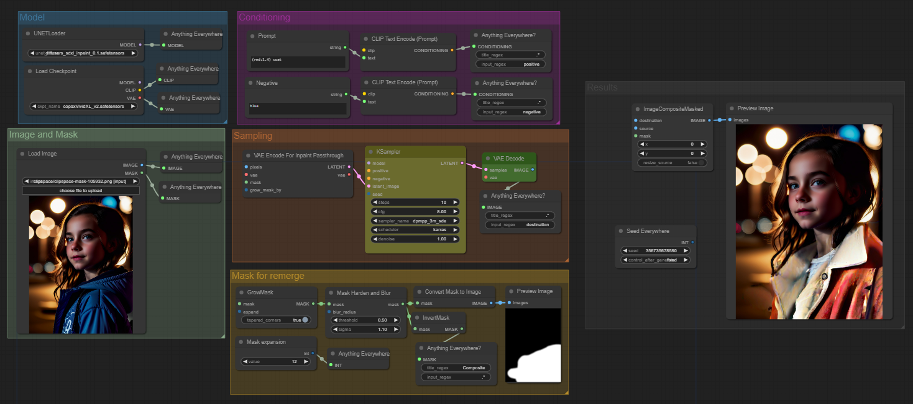

# UE Nodes

Shameless plug for my other nodes -> Check out [Image Picker](https://github.com/chrisgoringe/cg-image-picker) for another way to make some workflows smoother. And leave a star if you like something!

---

## Major Update...

The whole zoo of UE nodes has been replaced by `Anything Everywhere` nodes which take any input.

For backward compatibility, all the old nodes are still supported for the time being - you can find them in everywhere/deprecated. The only one still in the main folder is Seed Everywhere, which plays a slightly special role. Below are the instructions for the new nodes - then further down you can find the old documentation.

|Separate your workflow logically without spaghetti|This image has a simple example workflow you can drop onto Comfy|
|-|-|
|||

## Anything Everywhere

The Anything Everywhere node has a single input, initially labelled 'anything'. Connect anything to it (you probably can't connect via a reroute, but you shouldn't need to anyway), and the input name changes to match the input type. Disconnect and it goes back to 'anything'.

When you run the prompt, any unconnected input, anywhere in the workflow, which matches that type, will act as if it were connected to the same input. The node can also gain a text box showing exactly what passed through the node (you need to turn this on if you want it - it's in the main settings, 'Anything Everywhere node details')

|Unconnected|Connected|Run|
|-|-|-|
||||

## Anything Everywhere?

This node adds two widgets - title_regex and input_regex. It will only send to input which match. So in the example, title_regex is 'Preview' so the image is sent to the Preview Image node but not the Save Image node.

Regex 101 - ^ means 'the start', $ means 'the end', '.' matches anything, '.*' matches any number of anything. For more than that, visit [regex101](https://regex101.com/) (the flavour you want is ECMAScript, though that probably won't matter).

## Seed Everywhere

A special case - Seed Everywhere connects to any unconnected INT input with 'seed' in the input name. So you can use the same seed everywhere.

## Multiple Matches

What if there is more than one possible Everywhere node that an input could connect to? The nodes have priorities:

|Node|Priority|
|-|-|
|`Anything Everywhere?`|10|
|`Seed Everywhere`|5|
|`Anything Everywhere`|0|

So a matching regex is highest, and a Seed is above a general INT. If this rule isn't enough to decide, *no connection is made* and there's a message in the Javascript log.

## Caution

It's possible to create a loop with UE, and that currently isn't detected ([issue](https://github.com/chrisgoringe/cg-use-everywhere/issues/6)). If you get a RecursionError that's probably what you've done. Remember, *every* unconnected input gets connected to the UE output, even optional ones... you might want to use Anything Everywhere? nodes if this is a problem.

---

# Deprecated Nodes

This is the old documentation, in case you have a workflow still using the deprecated nodes. 

UE nodes are "Use Everywhere". Put a UE node into your workflow, connect its input, and every node with an unconnected input of the same type will act as if connected to it. 

CLIP, IMAGE, MODEL, VAE, CONDITIONING, or LATENT (want something else? Edit `__init__.py` line 3.)

Update: added INT, MASK, and CHECKPOIMNT - which combines MODEL, CLIP, and VAE, and a special node for SEEDs.

| Model, clip, vae, latent and image are all being automagically connected. | Drop this image into ComfyUI to get a working workflow. |
|-|-|
|||

## UE? Nodes

UE? nodes are like UE Nodes, but add two widgets, 'title' and 'input'. These are Regular Expressions, and the node will only send to nodes where the node Title and the unconnected input name match. 

It doesn't need to be a complete match - the logic is `regex.match(name) || regex.match(title)`, so if you want to match the exact name `seed`, you'll need something like `^seed$` as your regex.

Regex 101 - ^ means 'the start', $ means 'the end', '.' matches anything, '.*' matches any number of anything. For more than that, visit [regex101](https://regex101.com/) (the flavour you want is ECMAScript, though that probably won't matter).

| So you can do things like: | Drop this image into ComfyUI to get a working workflow. |
|-|-|
|||

## Widget?

A UE or UE? node with just one output can have the output converted to a widget. But the combination ones can't. Also note that if you convert it to a widget, you can't then change the title

Why not? because the code gets the data type from the input (weirdly the prompt doesn't contain the data type on outputs), and it's not available if it's a widget, because reasons, so the hack is to get the data type from what comes after `UE ` in the title...
