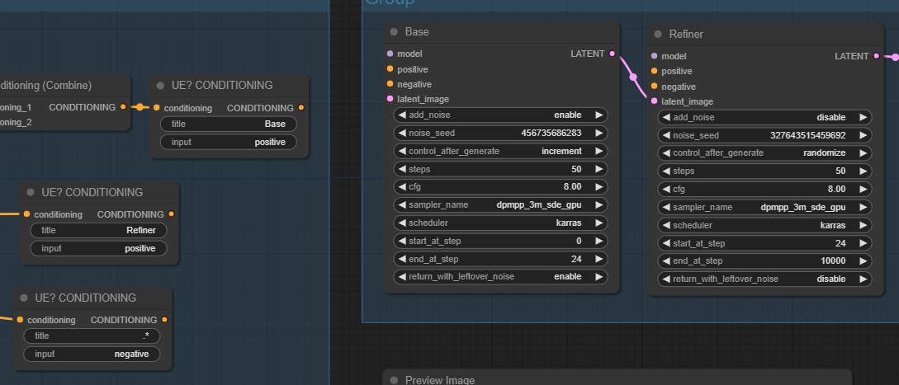
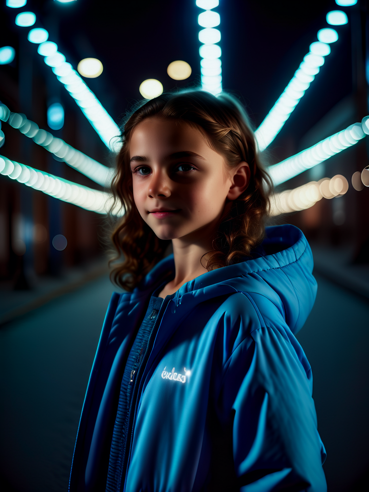

# UE Nodes

UE nodes are "Use Everywhere". Put a UE node into your workflow, connect its input, and every node with an unconnected input of the same type will act as if connected to it. 

CLIP, IMAGE, MODEL, VAE, CONDITIONING, or LATENT (want something else? Edit `__init__.py` line 3.)

| Model, clip, vae, latent and image are all being automagically connected. | Drop this image into ComfyUI to get a working workflow. |
|-|-|
|||

## UE? Nodes

UE? nodes are like UE Nodes, but add two widgets, 'title' and 'input'. These are Regular Expressions, and the node will only send to nodes where the node Title and the unconnected input match. 

| So you can do things like: | Drop this image into ComfyUI to get a working workflow. |
|-|-|
|||

## Seed Everywhere

A special case of UE? - Seed Everywhere connects to any unconnected INT input with 'seed' in the input name. So you can use the same seed everywhere.

## Widget?

A UE or UE? node with just one output can have the output converted to a widget. But the combination ones can't.

## Caution

It's possible to create a loop with UE, and that currently isn't detected. If you get a RecursionError that's probably what you've done. Remember, *every* unconnected input gets connected to the UE output, even optional ones...
