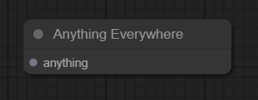
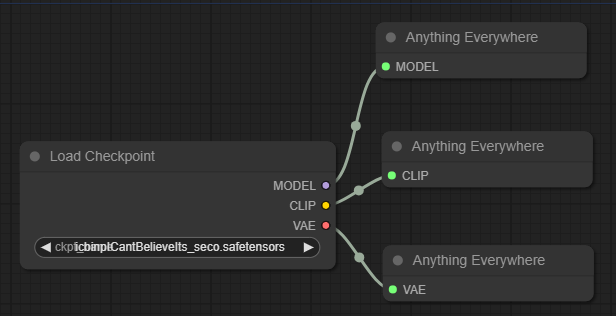
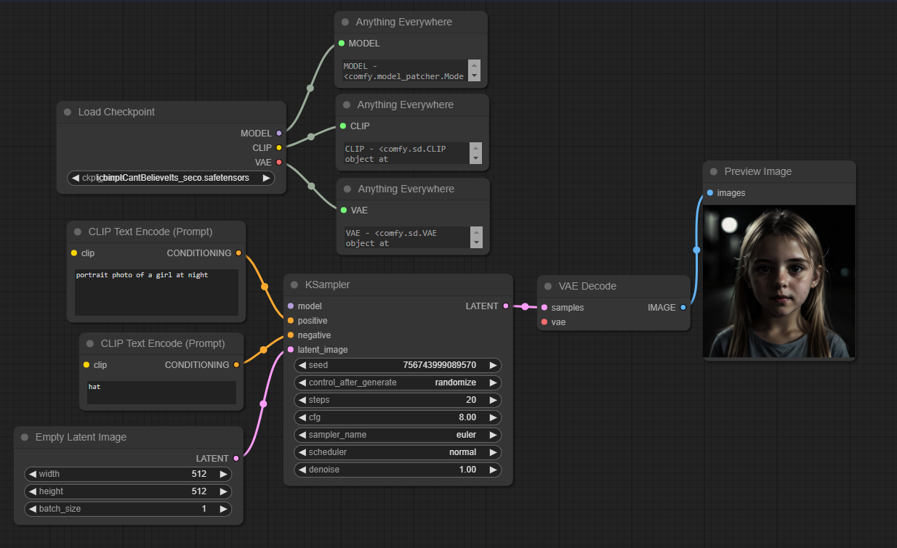

# UE Nodes

Shameless plug for my other nodes -> Check out [Image Picker](https://github.com/chrisgoringe/cg-image-picker) for another way to make some workflows smoother. And leave a star if you like something!

---

## v2.5 update

Main addition is visualising the virtual nodes - right click on the background (like when you add a node) and `Toggle UE Link Visibility`.

Also added `Anything Everywhere3` which is just 3 `Anything Everywhere` nodes in one - designed for when you load a checkpoint.

Under the hood a big refactor to make the visualisation work cleanly, and lots of logging (optional) added.

## v2 Update

The whole zoo of UE nodes has been replaced by `Anything Everywhere` nodes which take any input.

For backward compatibility, all the old nodes are still supported for the time being - you can find them in everywhere/deprecated. The only one still in the main folder is Seed Everywhere, which plays a slightly special role. Below are the instructions for the new nodes - then further down you can find the old documentation.

|Separate your workflow logically without spaghetti|This image has a simple example workflow you can drop onto Comfy|
|-|-|
|||

## Anything Everywhere - send data to every unconnected input of the same type

Details

The Anything Everywhere node has a single input, initially labelled 'anything'. Connect anything to it (you probably can't connect via a reroute, but you shouldn't need to anyway), and the input name changes to match the input type. Disconnect and it goes back to 'anything'.

When you run the prompt, any unconnected input, anywhere in the workflow, which matches that type, will act as if it were connected to the same input. The node can also gain a text box showing exactly what passed through the node (you need to turn this on if you want it - it's in the main settings, 'Anything Everywhere node details')

|Unconnected|Connected|Run|
|-|-|-|
||||

## Anything Everywhere? - control matching with regex rules

Details

This node adds two widgets - title_regex and input_regex. It will only send to input which match. So in the example, title_regex is 'Preview' so the image is sent to the Preview Image node but not the Save Image node.

## Help! How do I connect to prompt but not negative_prompt?

The matches are regular expressions, not straight string matches. So `^prompt` will match `prompt` at the beginning of the title only.

Regex 101 - ^ means 'the start', $ means 'the end', '.' matches anything, '.*' matches any number of anything. For more than that, visit [regex101](https://regex101.com/) (the flavour you want is ECMAScript, though that probably won't matter).

## Anything Everywhere3 - One node, three inputs.
Really just three `Anything Everywhere` nodes packaged together.  Designed for the outputs of Checkpoint Loader.

## Seed Everywhere - Send data to unconnected inputs with 'seed' in the input name
Seed Everywhere connects to any unconnected INT input with 'seed' in the input name. So you can use the same seed everywhere.

## What if there is more than one match?

Details

What if there is more than one possible Everywhere node that an input could connect to? The nodes have priorities:

|Node|Priority|
|-|-|
|`Anything Everywhere?`|10|
|`Seed Everywhere`|5|
|`Anything Everywhere`|0|

So a matching regex is highest, and a Seed is above a general INT. If this rule isn't enough to decide, *no connection is made* and there's a message in the Javascript log.

## Visualising the links - menu option to show all the virtual links

Details

Right-click on the canvas (like when you add a new node) and there is an option to visualise the links. The links thus shown will update dynamically as you change the graph, bypass nodes, edit regex's etc..

|Visualise off|Visualise on|
|-|-|
|||

## Caution

It's possible to create a loop with UE, and that currently isn't detected ([issue](https://github.com/chrisgoringe/cg-use-everywhere/issues/6)). If you get a RecursionError that's probably what you've done. Remember, *every* unconnected input gets connected to the UE output, even optional ones... you might want to use Anything Everywhere? nodes if this is a problem.

## Deprecated Nodes

[Old documentation](docs/deprecated.md)